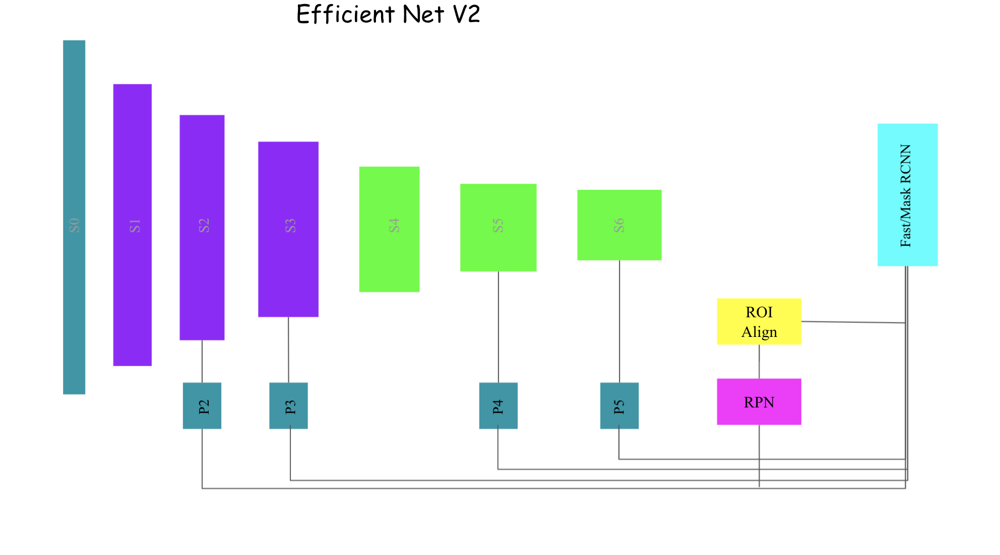

# EfficientNetV2 Detection

Implementation of [EfficientNetV2](https://arxiv.org/abs/2104.00298) backbone for detecting objects using [Detectron2](https://github.com/facebookresearch/detectron2).
The `EfficientNetV2` backbone is wrapped to `detectron2` and uses the Fast/Mask RCNN heads of detectron2 for detecting objects.
The architecture of the network and detector is as in the figure below.


Architecture of the network for detection.

# Coco Results
The results of detection on [2017 COCO](https://cocodataset.org/#download) detection dataset.

# Requirements
- [pytorch >= 1.7](https://github.com/pytorch/pytorch)
- [torchvision >= 0.8.2](https://github.com/pytorch/vision) 
- [detectron2 >= 0.4](https://github.com/facebookresearch/detectron2)
- [opencv-python >= 4.5](https://github.com/opencv/opencv-python)

# Installation
Clone the repository
```bash
$ git clone https://github.com/iKrishneel/efficient_net_v2.git
```
Installing on the host or virtualenv.
```bash
$ pip install -e efficient_net_v2
```

Using docker image
```bash
$ cd efficient_net_v2
$ IMG_NAME=effnet2_detect
$ docker buildx build -t ${IMG_NAME}:latest .
```

# Training
The trainin procedure and arugments are same as `detectron2`. Please refer to the `detectron2` documentations for more information the the training.

```bash
$ cd efficient_net_v2/efficient_net_v2

# common required arugments for training
$ NUM_GPUS=2 # number of GPUS for training
$ WEIGHTS=''  # path to the weight file / or you can provide this directly on the config
$ LOG_DIR='../logs/'  # logging folder

# To start training 
$ python build.py --config-file ./config/effnet_coco.yaml  --num_gpus ${NUM_GPUS} --weights ${WEIGHTS} --output_dir ${LOG_DIR}
```
